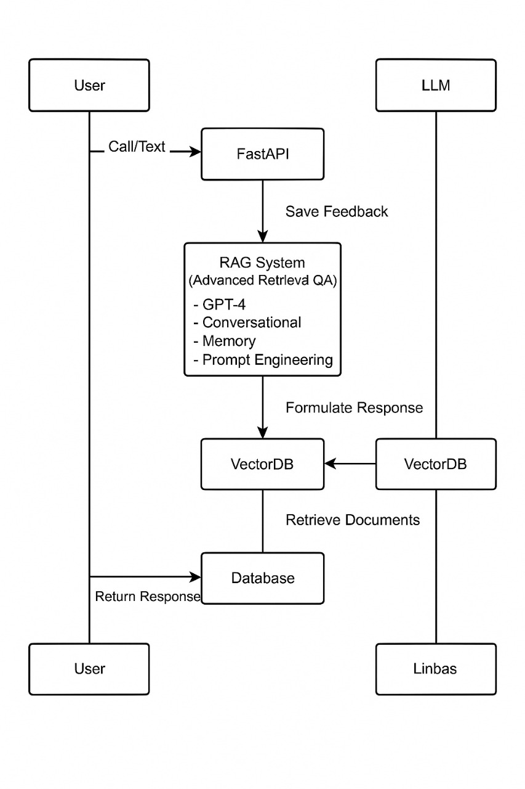

# 🛠️ Setup & Installation Guide

Welcome to the setup guide for the **TMU AI Voice Agent Project**.  
This guide will walk you through installing dependencies, setting up your environment, and running the application locally.

---

## 🧩 Prerequisites

Make sure you have the following tools installed on your system:

- ✅ **Python 3.10+**
- ✅ **`uv`** or built-in `venv` for virtual environments
- ✅ **Git** (optional but recommended)

> 🔍 You can check your Python version with:  
> `python --version`

---

## 🖼️ Architecture Diagram



---

## 🔧 Installation Steps

### 🔹 Step 1: Clone the Repository

```bash
git clone https://github.com/Rhytham16/TMU-interns-ai-voice-agent.git
cd TMU-interns-ai-voice-agent
```

---

### 🔹 Step 2: Create and Activate a Virtual Environment

```bash
uv venv
.\.venv\Scripts\activate  # Windows
source .venv/bin/activate  # macOS/Linux
```

> 🛠️ Make sure your virtual environment is activated in every new terminal session before continuing.

---

### 🔹 Step 3: Install All Required Dependencies

This project requires several Python packages for FastAPI, LangChain, ChromaDB, OpenAI, and more.

Run the following:

```bash
pip install -r requirements.txt
```

Or manually, you can install core dependencies:

```bash
pip install fastapi uvicorn langchain openai chromadb \
python-dotenv pydantic aiofiles requests PyPDF2 \
langchain-openai langchain-core langchain-community \
langchain-text-splitters websockets numpy SQLAlchemy \
coloredlogs humanfriendly
```

---

### 🔹 Step 4: Install Voice Libraries

For **speech input/output**, install these:

```bash
pip install pyaudio SpeechRecognition pyttsx3
```

> ⚠️ On Windows, `pyaudio` might need this first:
```bash
pip install pipwin
pipwin install pyaudio
```

---

### 🔹 Step 5: Run the App

```bash
python app.py
```

If everything is installed correctly, the app will start at:

```
http://localhost:8000
```

You can now:
- Use `/chat` endpoint to query your AI agent.
- Use `/upload` to add documents.
- Use `/ws/{session_id}` for WebSocket streaming.

---

## 🧪 Troubleshooting Tips

| Problem                         | Solution                                                                 |
|---------------------------------|--------------------------------------------------------------------------|
| 🔺 `activate.ps1` error         | Run `Set-ExecutionPolicy RemoteSigned -Scope CurrentUser`                |
| 🔺 `ModuleNotFoundError`        | Make sure your virtual environment is activated                          |
| 🔺 `localhost not loading`      | Ensure nothing else is using port 8000 or change the port in `app.py`    |
| 🔺 `pyaudio install error`      | Use `pipwin install pyaudio` instead of plain `pip install`              |

---

## ✅ You're All Set!

Your local server is now up and running.  
You're ready to explore document-based conversational AI using LangChain, FastAPI, and OpenAI models.

Happy coding! 🎉